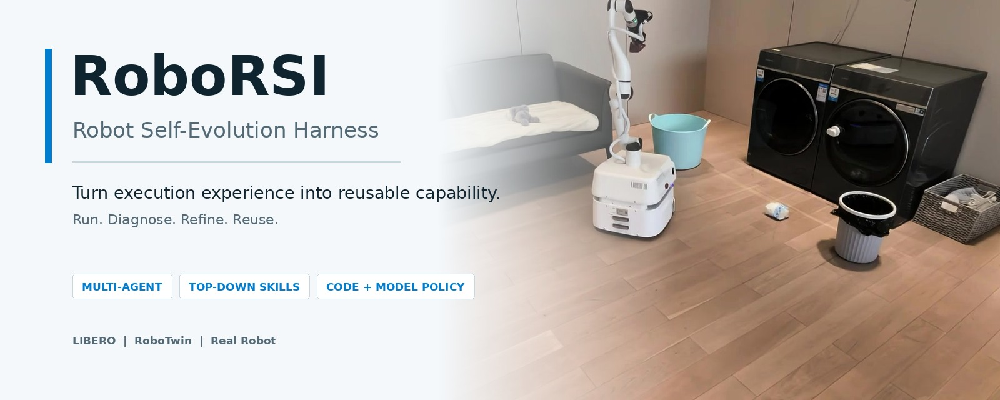
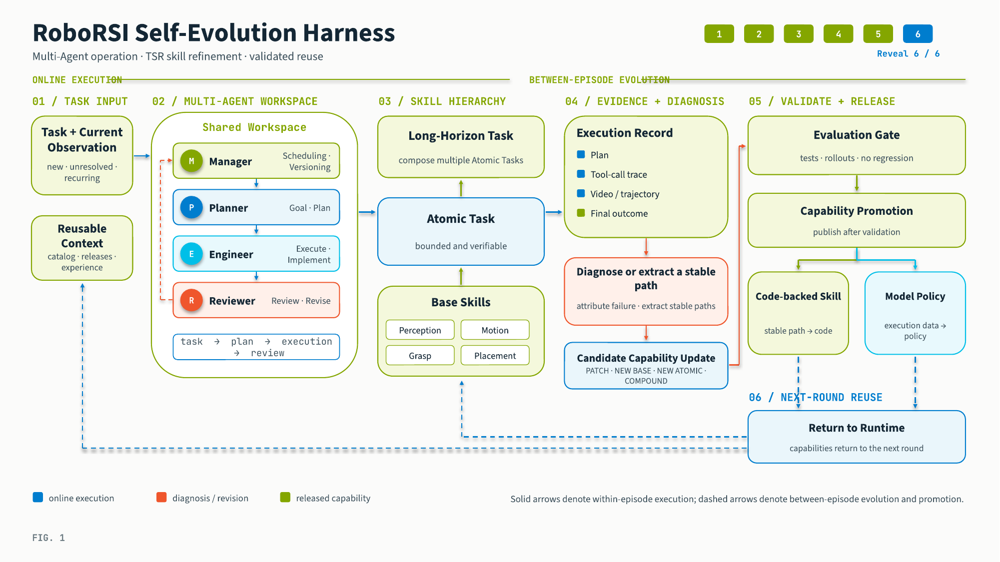
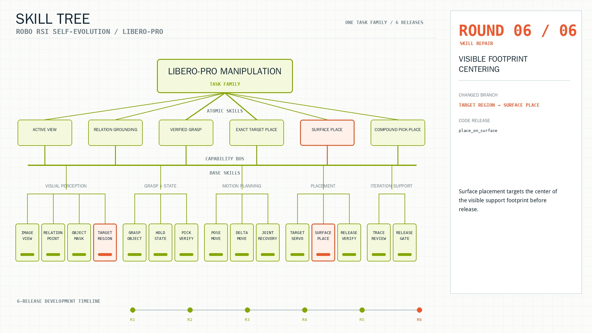
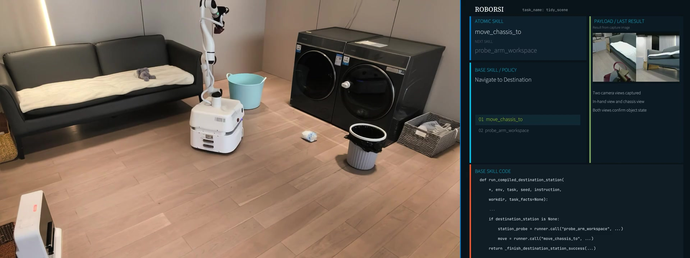

<p align="center">
  
</p>

<h1 align="center">RoboRSI</h1>

<p align="center">
  <a href="https://robo-rsi.com/">Project Website</a> |
  <a href="https://robo-rsi.com/blog/2-roborsi-research-preview/">Research Preview</a> |
  <a href="REPRODUCING.md">Reproduce</a> |
  <a href="SKILLS.md">Skill System</a>
</p>

<p align="center">
  <a href="LICENSE"></a>
  <a href="pyproject.toml"></a>
  <a href="REPRODUCING.md"></a>
  <a href="https://robo-rsi.com/blog/2-roborsi-research-preview/?lang=zh"></a>
</p>

<p align="center">
  <strong>A general-purpose robot self-evolution harness that turns execution
  experience into reusable capability.</strong>
</p>

RoboRSI coordinates robot tasks across repeated runs: Multi-Agent roles organize
planning, execution, diagnosis, and revision; Top-down Skill Refinement (TSR)
keeps changes local to an explicit skill hierarchy; stable paths can be
consolidated into code, while retained trajectories can feed Model Policies.

This repository ships the public **LIBERO short reference runtime**, a
replayable evidence bundle, the CLI and Web console, and a portable skill
catalog spanning LIBERO and RoboTwin.

<table>
  <tr>
    <td><b>Multi-Agent operation</b></td>
    <td>Manager, Planner, Engineer, and Reviewer divide task management, planning, execution, diagnosis, and revision into explicit responsibilities.</td>
  </tr>
  <tr>
    <td><b>Top-down Skill Refinement</b></td>
    <td>Task Families refine into Atomic Tasks, Base Skills, and reusable compounds, so a failure can be repaired at the responsible node.</td>
  </tr>
  <tr>
    <td><b>Code-backed reuse</b></td>
    <td>Repeated tool sequences can become parameterized Compound Skills, reducing repeated online tool selection.</td>
  </tr>
  <tr>
    <td><b>Data-to-policy loop</b></td>
    <td>Videos, trajectories, actions, and outcomes are retained in a training-ready form for downstream Model Policies.</td>
  </tr>
  <tr>
    <td><b>Evaluation-gated evolution</b></td>
    <td>Candidate skills load through isolated overlays and enter later runs only after the environment returns a final successful verdict.</td>
  </tr>
  <tr>
    <td><b>CLI and Web console</b></td>
    <td>Configure runs, monitor workers, inspect resources, replay evidence, browse skills, and export standalone reports from one interface.</td>
  </tr>
</table>

---

## Quick Start

### Replay the public result

This path needs **no API key, simulator, or GPU**.

```bash
git clone https://github.com/nssmd/RoboRSI.git
cd RoboRSI
./reproduce.sh
```

The command installs the core environment, replays the packaged evidence, and
writes:

```text
artifacts/reproduction/replay.json
artifacts/reproduction/dashboard.html
```

Expected output:

```text
Spatial     9/10
Object     10/10
Goal        9/10
LIBERO-90  67/90
Total      95/120
```

Open the evidence directly in the local Web console:

```bash
./roborsi web --public
```

### Run a new LIBERO campaign

Requirements: Linux, Python 3.10-3.12, Git, an OpenAI-compatible Responses
endpoint, and preferably an NVIDIA GPU.

```bash
export OPENAI_API_KEY="..."

./setup.sh --dev
./roborsi eval libero-short --mode adaptive --dry-run
./roborsi doctor
./roborsi eval libero-short --mode adaptive
```

Follow the run:

```bash
./roborsi runs list
./roborsi status
./roborsi web
```

`setup.sh` creates isolated environments, checks out pinned simulator
dependencies, writes a non-secret `roborsi.yaml`, starts the motion-planning
service, and runs diagnostics.

---

## How It Works

<p align="center">
  
</p>

<p align="center"><sub>Tasks move through Multi-Agent operation, hierarchical skills, execution, evidence, refinement, and validated reuse.</sub></p>

The runtime follows one continuous loop:

1. **Accept a task and current observation.**
2. **Organize work across roles.** The Manager owns task state, the Planner
   forms an executable plan, the Engineer calls tools and implements
   candidates, and the Reviewer attributes visible failures.
3. **Resolve the skill path.** TSR connects the task to Task Families, Atomic
   Tasks, Base Skills, Compound Skills, and Model Policies.
4. **Execute and retain evidence.** Plans, tool calls, videos, trajectories,
   timing, and Token usage remain attached to the episode.
5. **Refine the responsible node.** A local skill changes instead of rewriting
   the complete workflow.
6. **Validate and reuse.** Accepted capability returns to the runtime for the
   next task or pass.

### Skill hierarchy

```text
Task Family
  +-- Atomic Task
      +-- Base Skill
      +-- Base Skill
      +-- Compound Skill
      +-- Model Policy
```

Base Skills are namespaced by backend:

```text
src/roborsi/embodied/skills/base/
  grasp_object/
    libero/
      SKILL.md
      policy.py
    robotwin/
      SKILL.md
```

Inspect the catalog:

```bash
./roborsi skills list
./roborsi skills show libero/grasp_object
./roborsi skills show robotwin/grasp_object
./roborsi skills list --category atomic --backend libero --tag long
./roborsi skills validate
```

### Planner-driven LIBERO flow

Each LIBERO short episode resolves its public benchmark task key to one Atomic
Task profile and follows that profile's Task Family parent. The Planner receives
only the visible instruction and public capability descriptions, then writes:

```text
runs/<run-id>/episodes/<run>/<task>/seed-<n>/shard-<n>/attempt-<n>/roles/
  plan.json
  plan.md
```

`plan.json` records the Task Family, Atomic Task, and ordered planner steps.
Each step names an ordered sequence of published Base or Compound Skills. The
Engineer may use other visible tools for recovery, but a planner step is marked
complete only after its listed skill sequence succeeds in order. The final
task verdict still comes exclusively from the post-episode simulator predicate;
the Planner, Engineer, and Reviewer never receive that predicate or hidden
object state.

Adaptive code reuse is declarative. A proposed Compound Skill contains complete
`SKILL.md` metadata plus a bounded program such as:

```python
PROGRAM = [
    {"tool": "find_pixel", "args": {"object": "$object"}},
    {"tool": "grasp_object", "args": {"object": "$object"}},
]
```

The static gate permits only a non-empty literal sequence of published visible
tools, rejects arbitrary Python and undeclared `$argument` placeholders, and
stages accepted candidates under `candidate_overlays/`. Promotion requires
final simulator success on two fixed validation seeds, including a distinct
holdout when available. Infrastructure interruptions keep the same candidate,
release identity, and validation seeds pending for retry. An already successful
task/seed is never rerun.

Render the retained plan, verdict rounds, and promotion records for one task:

```bash
./roborsi visualize skill-tree \
  --run <run-id> \
  --task libero_object/0 \
  --output artifacts/libero-object-0-skill-tree.html \
  --no-browser
```

The current package contains:

| Layer | Public contents |
| --- | --- |
| Base Skills | 35 code-backed LIBERO skills and 51 RoboTwin interface contracts |
| Atomic Skills | 120 LIBERO short, 10 LIBERO long-horizon, and 52 RoboTwin task profiles |
| Task Families | 11 reusable decomposition and execution profiles |
| Executors | 2 LIBERO execution modes |
| Compound Skills | 2 code-backed compositions |

RoboTwin contracts are marked `requires_robotwin_backend`; the executable
public runtime in this repository is LIBERO.

---

## Evolution In Practice

<table>
  <tr>
    <td width="50%">
      
    </td>
    <td width="50%">
      
    </td>
  </tr>
  <tr>
    <td align="center"><sub>Skill branches are added, revised, and stabilized across iterations.</sub></td>
    <td align="center"><sub>The same hierarchy connects navigation, perception, manipulation, and retained tool traces.</sub></td>
  </tr>
</table>

The repository keeps the claim surface narrow:

- `evidence/adaptive-coverage-v1/` replays **95/120 cumulative task coverage**
  from the published LIBERO short adaptive release lineage.
- Every counted task has a final simulator-success record.
- Infrastructure interruptions remain separate from task failures.
- Agent-visible prompts, plans, tools, and skills do not receive hidden
  simulator state or task-success predicates.

The packaged `95/120` result is adaptive cross-release development coverage,
not a frozen-policy score. See [REPRODUCING.md](REPRODUCING.md) for the exact
track definitions and comparison rules. Full videos, interactive Skill Trees,
additional simulation panels, and real-robot demonstrations are available on
the [project website](https://robo-rsi.com/).

---

## CLI And Web Console

| Goal | Command |
| --- | --- |
| Configure a run | `./roborsi configure` |
| Check the environment | `./roborsi doctor` |
| Start an adaptive campaign | `./roborsi eval libero-short --mode adaptive` |
| Start a fixed-release campaign | `./roborsi eval libero-short --mode fixed` |
| List campaigns | `./roborsi runs list` |
| Inspect current progress | `./roborsi status [RUN]` |
| Open the latest campaign | `./roborsi web` |
| Replay packaged evidence | `./roborsi results replay` |
| Browse skills | `./roborsi skills list` |
| Render the Skill Tree | `./roborsi visualize skill-tree` |
| Render a campaign task | `./roborsi visualize skill-tree --run RUN --task TASK` |

The Web console reads retained campaign state directly. It shows cumulative
coverage, suite results, final verdict counts, release history, Token usage,
VLM calls, and elapsed episode time.

```bash
./roborsi web --run <run-id>
./roborsi web --public
./roborsi web --run <run-id> --output artifacts/run.html --no-browser
```

---

## Evaluation Tracks

| Track | Skills evolve? | Simulator required? | Output |
| --- | --- | --- | --- |
| Evidence replay | No | No | Recomputed `95/120` public coverage and Web report |
| Adaptive campaign | Yes, after validation | Yes | Task-level adaptive Pass@10 |
| Fixed campaign | No | Yes | Task-level fixed-release Pass@10 |

For new campaigns:

- the short catalog contains exactly 120 tasks;
- ordered seeds are `0..9`;
- any final simulator-confirmed success solves a task once;
- successful task/seed pairs are protected from reruns;
- provider, transport, image, resource, and interrupted attempts are excluded
  from task denominators;
- adaptive and fixed results remain separate.

<details>
<summary><b>Configuration example</b></summary>

```yaml
provider:
  model: responses/gpt-5.6-sol
  reasoning_effort: medium
  base_url: https://api.openai.com/v1
  api_key_env: OPENAI_API_KEY

simulator:
  root: .deps/LIBERO
  mujoco_gl: egl
  controller: JOINT_POSITION
  image_size: 512
  horizon: 5000

runtime:
  results_root: runs
  workers: 8
  gpu_devices: [0]

evaluation:
  mode: adaptive
  seeds: [0, 1, 2, 3, 4, 5, 6, 7, 8, 9]
  task_count: 120
  tool_budget: 120
```

Only the environment-variable name is stored. The secret is not written to
the configuration file.

</details>

<details>
<summary><b>Run artifact layout</b></summary>

```text
runs/<run-id>/
  manifest.json
  config.resolved.yaml
  state.json
  result.json
  supervisor.log
  journals/
  logs/
  media/
  traces/
  trajectories/
  episodes/
  proposals/
  candidate_overlays/
  releases/
  workspace/
```

Failed runs and rejected candidates are retained. Adaptive proposals load
through isolated overlays and cannot replace the active release before the
two-seed simulator gate passes.

</details>

---

## Repository Layout

```text
src/roborsi/     agent roles, runtime, skills, CLI, evaluation, and Web console
evidence/        compact replayable result bundle
scripts/         setup, service, audit, and release helpers
tests/           public-contract and runtime tests
docs/assets/     public README visuals mirrored from the project Blog
reproduce.sh     one-command public-result replay
```

The project website and large video library are maintained separately from the
runtime package.

## Development

```bash
./setup.sh --core-only --dev
source .venv/bin/activate

pytest -q -m "not runtime"
ruff check src/roborsi/libero tests scripts
python scripts/release_check.py
./reproduce.sh --skip-setup --output-dir /tmp/roborsi-reproduction
python -m build
```

Runtime or skill-execution changes also require:

```bash
./setup.sh --dev
pytest -q
python scripts/check_libero_gt_leak.py
```

Read [CONTRIBUTING.md](CONTRIBUTING.md) before changing a visible skill,
evaluation contract, or promotion rule. Security guidance is in
[SECURITY.md](SECURITY.md).

## Citation

Citation metadata is provided in [CITATION.cff](CITATION.cff).

```bibtex
@software{roborsi2026,
  title  = {RoboRSI LIBERO: Skill-First Adaptive Robot Evaluation},
  author = {RoboRSI Contributors},
  year   = {2026},
  version = {0.1.0},
  url    = {https://github.com/nssmd/RoboRSI}
}
```

## License

RoboRSI is released under the [Apache License 2.0](LICENSE). LIBERO, PyRoKi,
and optional external services retain their upstream licenses and terms.
