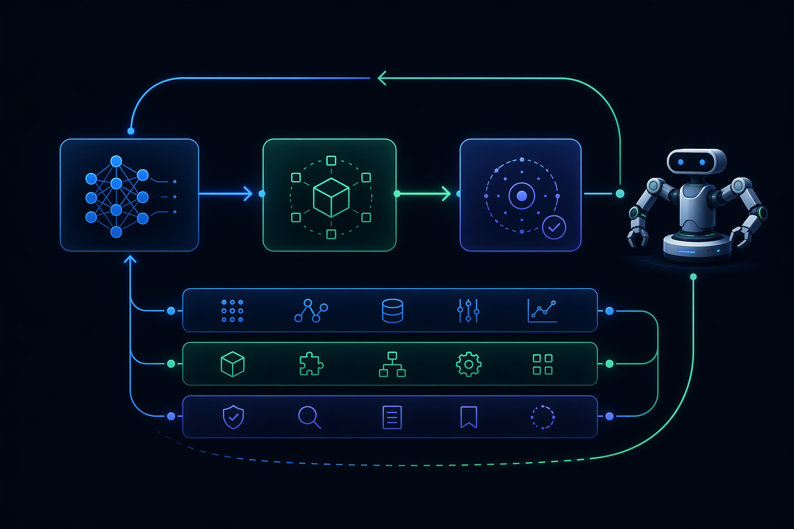

<h1 align="center">RoboRSI</h1>

<p align="center">
  
  
  
  
  <a href="https://discord.gg/HNcDbDYR"></a>
</p>

> **A multi-agent harness for self-evolving robot skills**, with LIBERO,
> RoboTwin, BiCoord-Bench, and real-robot execution paths. Skills are first-class
> citizens: agents plan, execute, review, and refine them through a gated loop.

<p align="center">
  
</p>

---

## Why RoboRSI?

Most robot-manipulation stacks sit at one of two extremes. **Hand-coded pipelines** are inspectable but brittle — a new task means new code. **Monolithic end-to-end policies (VLAs)** generalize within their training distribution but are data-hungry, opaque, and hard to debug. RoboRSI takes a third path: **keep skills as small, inspectable units, let a VLM compose them, and let the system rewrite its own skills when they fail.**

| | Hand-coded pipeline | Monolithic VLA | **RoboRSI** |
|---|:---:|:---:|:---:|
| New task **without** retraining | ✗ | ✗ (needs data) | **✓** — VLM composes existing skills |
| Inspectable / debuggable | ~ | ✗ | **✓** — every skill is `SKILL.md` + `policy.py` |
| **Improves itself** on failure | ✗ | ✗ | **✓** — propose → gate → apply loop |
| Add a new robot | rewrite | retrain | **✓** — copy `base/<robot>/` |

**One sentence:** *skill is the first-class citizen, the VLM is the driver, `base` is the muscle, `atomic` is the motion, `long_horizon` is the task.* The framework is just the scheduler — everything about *what to do* lives inside skills.

---

## How it works

### 1 · Three layers of skills

```
long_horizon/<task>/   user instruction → VLM decomposes into an ordered atomic sequence
        ▼              (each phase boundary scored by a progress judge, full trace logged)
atomic/<task>/         one self-contained task; VLM zero-shot drives base tools to do it,
        ▼              and can graduate to a trained policy:vN (the data flywheel)
base/<robot>/<prim>/   robot primitives — grasp, move, gripper, perceive. Dual-form:
                       callable by atomics AND exposed to the VLM as a tool.
```

### 2 · Manager + three execution roles

```
Manager ──► Planner ──► Engineer (VLM "rollout") ──► Reviewer
   │           │                │                       │
task queue   plan.md       per-step tool loop      structured verdict:
approval     strategy      look → skill → act      root cause, next action,
versions     and reuse     → observe               proposal when warranted
```

The Manager is persistent and owns task routing and proposal application.
Planner and Reviewer keep per-task sessions; Engineer remains stateless and
executes the current plan against the live environment.

### 3 · Self-improving skills

When an atomic keeps failing, the agent can propose a change to a skill instead of only retrying:

```
①  fail        Reviewer locates the root cause
②  propose     propose_new_skill / propose_skill_update
③  gate        harness gate — a no-regression check on a real sim task (never skipped)
④  apply       gate passes → committed → the next attempt uses the improved skill
```

Every applied change is an ordinary, gated git commit — for example the
agent-authored primitives `push_toggle_lateral` and `press_button_at_xyz`, plus
incremental refinements to existing skills. The full history remains auditable
in git.

---

## Frozen evaluation

`roborsi eval` runs the same Planner → Engineer → Reviewer path against a frozen
release:

```bash
roborsi eval libero_pick_place \
  --backend libero \
  --sim-task libero_object/0 \
  --seeds 5
```

Evaluation keeps per-run plans, reviews, traces, videos, timing, tool calls, and
the final simulator verdict. It does **not** create or apply proposals, register
skills, update task wikis or persistent plans, append successful-plan history,
reuse persistent role sessions, or place episodes in the training data store.
Run rows are marked `run_mode=eval`; evaluation datasets live separately under
`~/.roborsi/evals/`. Each invocation also writes a campaign manifest, and
infrastructure errors are reported separately rather than counted as failures.

Run a resumable LIBERO short-suite task-level pass@5 evaluation with:

```bash
roborsi eval-suite \
  --backend libero-pro \
  --pass-at 5 \
  --workers 4 \
  --out ~/.roborsi/evals/libero-pro-pass5
```

The output directory pins the task panel, seeds, role models, tool budget, and
retry policy in `campaign.json`; incompatible resumes are rejected.

`roborsi bench skill ...` uses frozen `eval` mode by default. See
[Frozen evaluation](./docs/EVALUATION.md) for the complete boundary.

---

## Integrity by construction

RoboRSI is built so the numbers can't lie to you:

- **Success is judged by the simulator's own `check_success` predicate**, never the model's own "I'm done" claim.
- **The predicate is evaluated only after the Agent tool loop**; per-action
  rewards, success flags, object-state observations, and the final predicate are
  not exposed through the LIBERO skill interface.
- **No physics overrides** — no `expert_replay`, no force-attach/teleport, no hard-coded answers. The Engineer reads live coordinates from the scene every time.
- **Demos are recorded only when the predicate genuinely passes**, so a saved demo means the task was physically completed.
- **Generated policy code is capability-limited** to literal calls into the released public skill surface; it cannot read `state.env`, simulator internals, files, processes, or networks.
- **Proposal validation is enforced twice**: before automatic validation and again immediately before code is written.

---

## Benchmarks

RoboRSI includes zero-shot and iterative evaluation paths for:

- **[LIBERO](https://github.com/Lifelong-Robot-Learning/LIBERO)** — single-arm
  manipulation and perturbation evaluation.
- **[RoboTwin](https://github.com/TianxingChen/RoboTwin)** — single-arm atomic manipulation: grasp, place, press, open/close, rotate, dual-arm pick…
- **BiCoord-Bench** — bimanual & long-horizon tasks orchestrated end-to-end through RoboRSI' own `plan → atomics → progress-judge` loop (not the benchmark's built-in expert).

The hardest long-horizon task solved end-to-end so far is **`handover_block_bicoord`** — a two-arm tilt-and-pour hand-off (transfer a block between bowls, then place on a target), passing both phase judges. See `docs/` for per-task traces.

> ℹ️ We are currently re-running the full RoboTwin suite under the strict sim-predicate gate; headline pass counts will be published once that re-verification completes.

---

## 📦 Installation

Ask your coding assistant:

```text
Help me install RoboRSI from https://github.com/nssmd/RoboRSI
```

or follow the guides:

- [Non-Docker Installation](./docs/INSTALLATION.md)
- [Docker Installation](./docs/DOCKERINSTALLATION.md)
- [Architecture deep-dive](./docs/architecture.md)

Start the local interfaces after installation:

```bash
roborsi web
```

The evolution dashboard is served on `http://127.0.0.1:8787` and the Manager
session cockpit on `http://127.0.0.1:8795`.

---

## 📢 News

- **2026-04-11** Web dashboard for the full embodied workflow.
- **2026-03-24** Conversational arm setup, calibration, teleoperation, data collection, training, inference.
- **2026-03-17** Embodied framework skeleton, domain contracts, assembly-centered onboarding controller.
- **2026-03-12** Repository created.

---

## 🤝 Community co-creation

RoboRSI is built in the open. Direction-setting choices — embodiment support, simulator priorities, roadmap — are discussed with the community.

**Where help is most useful right now:** embodied-AI architecture · capability abstraction & semantic skill interfaces · ROS2 / execution-layer integration · simulator support & real-robot adaptation · evaluation & developer experience.

Contribute via [Issues](https://github.com/nssmd/RoboRSI/issues) and Pull Requests.

- Discord: [Join the server](https://discord.gg/HNcDbDYR)
- GitHub Issues: [Open an issue](https://github.com/nssmd/RoboRSI/issues)

## 🙏 Acknowledgments

RoboRSI inherits part of its initial thinking from [nanobot](https://github.com/HKUDS/nanobot) and the lightweight [OpenClaw](https://github.com/openclaw/openclaw) line, which helped us reach a first prototype faster.

## Citation

```bibtex
@misc{roborsi2026,
  title        = {RoboRSI: A Skill-First Framework for Embodied Manipulation},
  author       = {RoboRSI Contributors},
  year         = {2026},
  howpublished = {\url{https://github.com/nssmd/RoboRSI}}
}
```
