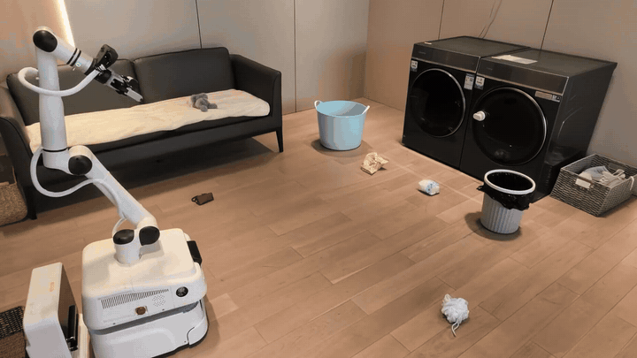

<h1 align="center">RoboRSI</h1>

<p align="center">
  <strong>在真实复杂场景中实现稳定、高效、可复用的机器人自进化。</strong>
</p>

<p align="center">
  <a href="README.md">English</a> | 简体中文
</p>

<p align="center">
  <a href="LICENSE"></a>
  
  
</p>

RoboRSI 是一套机器人自进化的 Multi-Agent 框架。Manager 负责任务拆解,Planner
生成可执行计划,Engineer 在真实环境中驱动技能执行,独立的 Reviewer 依据可见
trace 做诊断。自顶向下的技能细化(TSR)把所有能力组织在一棵任务—技能树上:
在线探索寻找解法,稳定流程固化为代码,执行数据可以训练 learning-based
policy,失败则回到最早出错的节点修订。

项目主页:<https://lab.noematrix.ai/blog/2-roborsi-research-preview/>

<p align="center">
  <br>
  <em>真机完整任务链(16 倍速)—— <a href="https://lab.noematrix.ai/blog/2-roborsi-research-preview/">完整视频与精确工具调用链见项目主页</a></em>
</p>

<p align="center">
  
</p>

## 实验结果

| 指标 | 结果 | 口径 |
|---|---:|---|
| LIBERO 累计任务通过率 | **95/120** | 跨 release 自适应覆盖;十轮顺序迭代从 32/120 提升到 83/120 |
| LIBERO-PRO 累计任务通过率 | **80/120** | 五个自适应 release,累计任务覆盖 43 → 80 |
| LIBERO-Plus 扰动实例通过率 | **398/840**(自适应 Pass@2) | 840 = 7 类扰动 × 每类 120 个实例;固定版本 261/840;提升 16.3 个百分点 |
| Code-on / Code-off 回合通过率 | **174/600 vs 129/600** | 每组 120 个任务 × 5 个初始布局;提升 7.5 个百分点 |
| 匹配效率面板(118 个任务) | Token **−29.4%** · VLM 调用 **−27.2%** · 墙钟时间 **−17.0%** | Code-on 对 Code-off 的中位数 |
| RoboTwin 累计任务通过率 | **36/50** | Planner + Engineer + Reviewer;单角色 baseline 9/50 |
| 纠正数据训练 learning-based policy | 1 个同任务成功案例 | 304 帧纠正轨迹 → 2,432 个样本 → 1,000 步微调 |

累计任务通过率统计的是"至少通过一次"的任务数,跨演化中的多个
release,不是固定策略分数,也不是常规固定方法的 Pass@k。完整口径、视频与
精确工具调用链见[项目主页](https://lab.noematrix.ai/blog/2-roborsi-research-preview/)。

## 工作原理

```
long_horizon/<task>/   任务族:用户指令 → 有序的原子任务序列
        ▼
atomic/<task>/         原子任务:边界明确、结果可验证;稳定路径固化为代码
        ▼              (例如 visual_pick_place)
base/<robot>/<prim>/   基础技能:感知、运动、抓取、放置 —
                       既可被原子任务调用,也作为工具暴露给 Agent
```

```
Manager ──► Planner ──► Engineer ──► Reviewer
任务队列     plan.md     工具循环     根因定位 + 修订提案
```

任务反复失败时,Reviewer 定位最早出错的节点并提出技能修改提案;提案必须在
真实仿真任务上通过无回退门禁才能提交。每次通过的修改都是一个普通的 git
commit,全部历史可审计。

评测(`roborsi eval` / `eval-suite`)用同一条角色链在冻结 release 上运行,
自进化与持久写回被禁用。成功与否只由仿真器自身的判定谓词在 Agent 循环结束
后裁定;journal 只追加不修改,`roborsi eval-audit` 可独立复核分数。

## 安装

### 一键复现

```bash
git clone https://github.com/nssmd/RoboRSI.git && cd RoboRSI
export OPENAI_API_KEY="..."   # 任意 OpenAI 兼容 Responses 端点
scripts/reproduce_libero_pro.sh
```

脚本自动完成:创建隔离环境 → 安装 RoboRSI → clone LIBERO-PRO → 从
HuggingFace 官方数据集
[`zhouxueyang/LIBERO-Pro`](https://huggingface.co/datasets/zhouxueyang/LIBERO-Pro)
下载扰动资产 → 配置并体检后端 → 启动 PyRoKi IK/轨迹优化服务 → 启动冻结
code-on Pass-1 评测 → 独立复核 journal。脚本幂等、可断点续跑。新评测针对
当前冻结 release,不回放上表中的累计结果(边界见
[docs/EVALUATION.md](./docs/EVALUATION.md))。

### 手动安装

见 [docs/INSTALLATION.md](./docs/INSTALLATION.md) 与
[docs/DOCKERINSTALLATION.md](./docs/DOCKERINSTALLATION.md)。

```bash
pip install -e ".[libero]"
git clone --depth 1 https://github.com/Zxy-MLlab/LIBERO-PRO.git
hf download zhouxueyang/LIBERO-Pro --repo-type dataset --local-dir ./LIBERO-PRO-assets
roborsi libero configure \
  --root ./LIBERO-PRO \
  --bddldir ./LIBERO-PRO-assets/bddl_files \
  --initdir ./LIBERO-PRO-assets/init_files
roborsi libero doctor --backend libero --task libero_object/0 --reset
roborsi web   # 演化看板 :8787 · Manager 控制台 :8795
```

## 社区

扫码加入微信用户交流群(二维码会定期更新):

<p align="center">
  
</p>

## 引用

```bibtex
@misc{noematrix2026roborsi,
  author       = {{Noematrix Team}},
  title        = {RoboRSI: Stable, Efficient, and Reusable Robot Self-Evolution in Complex Real-World Environments},
  year         = {2026},
  month        = sep,
  howpublished = {Research Blog},
  url          = {https://lab.noematrix.ai/blog/2-roborsi-research-preview/}
}
```
